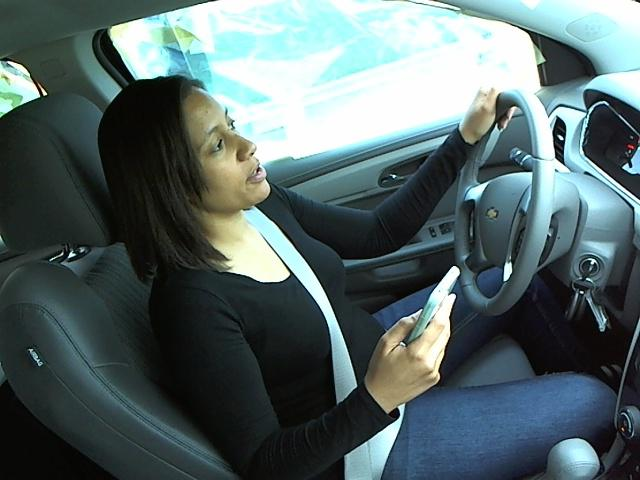
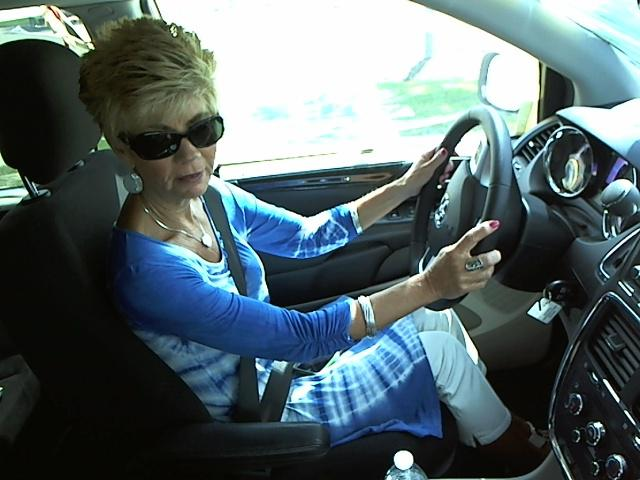
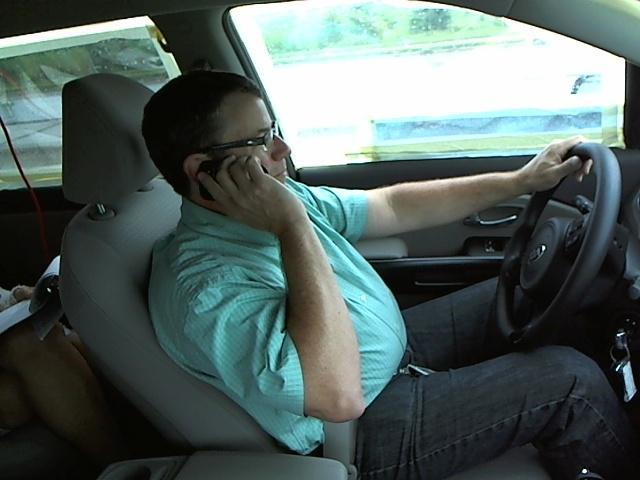
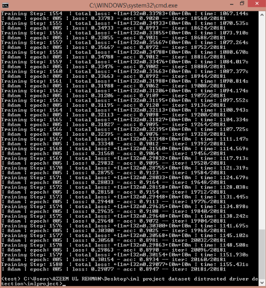
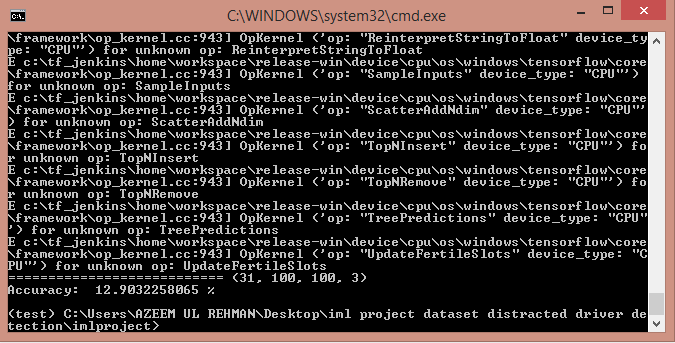
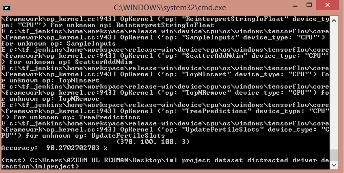

# Distracted-Driver-Detection

### Overview

The objective of this project is to detect
whether the driver driving the car is doing any activity that can cause
accident or any other harm to the driver or any other person moving on the
road. We are given driver images, each taken in a car with a
driver doing something in the car (texting, eating, talking on the phone,
makeup, reaching behind, etc). Your goal is to predict the
likelihood of what the driver is doing in each picture. 

The 10 classes to
predict are:

c0: safe driving

c1: texting - right

c2: talking on the phone -
right

c3: texting - left

c4: talking on the phone - left

c5: operating the radio

c6: drinking

c7: reaching behind

c8: hair and makeup

c9: talking to passenger

During the training phase, we have a dataset that have different
types of images classified into 10 classes(downloaded from Kaggle) , and every
class has an image of a driver performing different type of distracting
activity.we use those recorded data to train our neural network. Trained model
was tested on our own dataset that has around 31 images ,the accuracy on that
dataset is around 13% , the reason is the angle as we didnt flip the pictures
while training our model on Kaggle's Dataset.So thats why the accuracy is around 
13% but when we had tested the dataset with some kaggle dataset images then we get 
an accuracy of 90%.

### Dependencies

This project requires **Python 3.5** and the following
Python libraries installed:

- [NumPy](http://www.numpy.org/)
- [SciPy](https://www.scipy.org/)
- [TensorFlow](http://tensorflow.org)
- [Pandas](http://pandas.pydata.org/)
- [OpenCV](http://opencv.org/)
- [Matplotlib](http://matplotlib.org/) (Optional)
- [Jupyter](http://jupyter.org/) (Optional)

Run this command at the terminal prompt to install
[OpenCV](http://opencv.org/). Useful for image processing(if in case you are
doing real time detection):

- `conda install -c https://conda.anaconda.org/menpo
opencv3`

### How to Run the Model

This repository comes with trained model which you can
directly test using the following command.

- `python tf_cnn_train.py`

After training the dataset.This repository comes with
trained model which you can directly run using the following command.

- `python tf_cnn_test.py`

## Implementation

### DataSet

During the training, the image preloader loads the dataset
and saves it in X and Y, X isour input and Y is our output. After we form a
network of convolutional layer. Assign the network, run it for 5 epoche with
batch-size '64' and learning rate alpha=0.001. After that we fit the model and
saves the model. The following figure shows an example I have collected during
the training time.

 
 

Collected data are processed before feeding into the deep
neural network and those preprocessing steps are described in the latter part
of this file. 

### Dataset Preprocessing

The dataset consists of 25000 images. The training dataset contains
a lot of different angle images. Therefore, preprocessing images are
necessary in order to generalize the training model for our validation
dataset.

Next, we are going to explain our data processing pipeline.

### Data Processing 

In the very first state of the pipeline, we apply random
shear operation. However, we select images with 0.5 probability for the random
shearing process. 

The next stage of the data processing pipeline is called
random flip stage. In this stage we randomly (with 0.5 probability) flip
images. The idea behind this operation is left turning bends are more prevalent
than right bends in the training dataset. Hence, in order to increase the
generalization of our mode, we flip images and respective steering angles. That
is not being applied in our project but it should be applied in order to obtain
better accuracy.

In the final state of the pipeline, we resize images to
100x100 in order to reduce training time. 

Next we are going to discuss our neural network
architecture.

### Network Architecture 

We are using MaxPooling layers just after each  Convolutional Layer in order to cut down
training time. For more details about our network architecture please refer
following figure(only just to describe the basics of the Architecture).

Layers

          Conv: 64 filters of size 3x3 with ReLU activation
          Pooling: with filter size 2x2
          Conv: 32 filters of size 3x3 with ReLU activation
          Pooling: with filter size 2x2
          Conv: 32 filters of size 3x3 with ReLU activation
          Pooling: with filter size 2x2
          Fully Connected: with 256 neurons and ReLU activation and dropout with probability 0.75
          Fully Connected: with 256 neurons and ReLU activation and dropout with probability 0.75
          Fully Connected output layer: with 10 neurons (equal to number of classes) and softmax classifier.

### Training

Even after cropping and resizing training images (with all
augmented images), training dataset was very large and it could not fit into
the main memory. Hence, we used `fit_function` API of the Keras library for
training our model.

## Results

In the initial stage of the project,I used a training dataset that i have 
downloaded in kaggle and train in in this dataset.the images of trained dataset
is around 25000 and achieve the accuracy is about approx 90%.After that I used 
a dataset generated by myself. That dataset was small and recorded while sitting 
in the car with the same position as in kaggle’s dataset. However, the dataset that
has around 31 images ,the accuracy on that dataset is around 13% , the reason
is the ‘angle’ as we didnt flip the pictures while training our model on Kaggle's
Dataset.So thats why the accuracy is around 13% but when we had tested the dataset
with some kaggle dataset images then we get an accuracy of 90%.

#### Training

  
 

#### Test

 
###### Own dataset accuracy 

 
###### Combined dataset containing  own dataset and trained dataset

## Conclusions and Future Directions

In this project, we were working on a classification problem
in context of distracted driver detection. In the initial phase, we mainly
focused on finding a suitable network architecture and trained a model using
Kaggle’s dataset.It didn't perform as expected when we test the model using our
own Dataset(we have to insert images from Kaggle’s Dataset because we didn’t
use flipping , and the pictures are not flipped while testing) . 

When it comes to extensions and future directions, I would
like to highlight followings.

* Train a model in real road conditions and with flipping
the train dataset.
* Experiment with other possible data augmentation
techniques.
* Testing using vison based techniques by videos.
